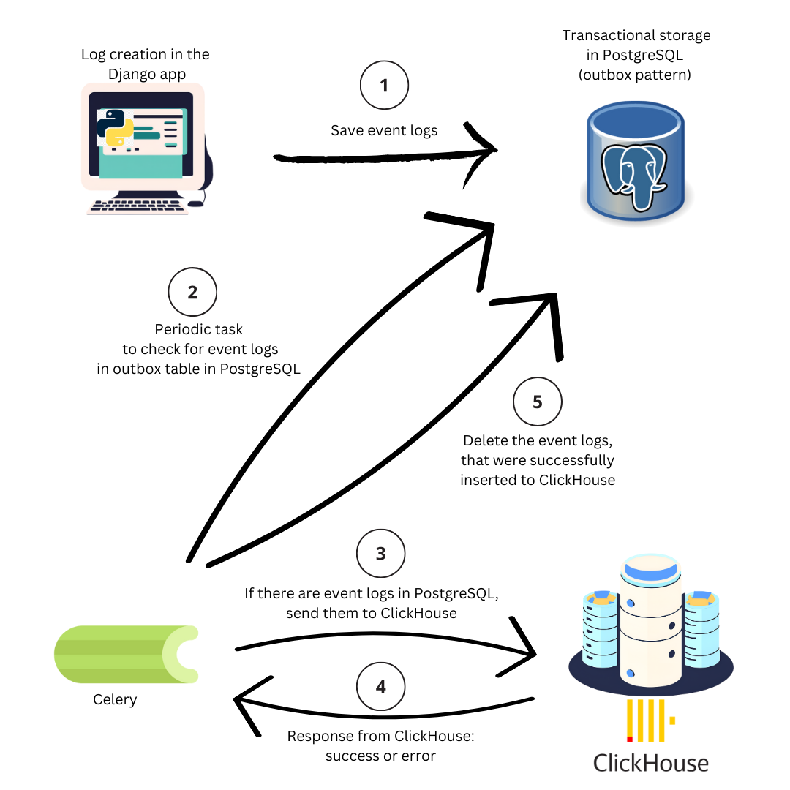

# Die Hard

## Attribution

This test task was cloned from [kobzevvv](https://github.com/kobzevvv/backender-challenge/tree/main). The project is based on his design and requirements to demonstrate backend development skills using the following tech stack:
- Python 3.13
- Django 5
- pytest
- Docker & docker-compose
- PostgreSQL
- ClickHouse

All implementations and additions in this repository are contributed by [Nuray Serkali](https://github.com/nuray0) for the purpose of completing the assigned task.


## Installation

Put a `.env` file into the `src/core` directory. You can start with a template file:

```
cp src/core/.env.ci src/core/.env
```

Run the containers with
```
make run
```

and then run the installation script with:

```
make install
```

## Tests

`make test`

## Linter

`make lint`


## What I did to implement the task

### 1. models.py (EventOutbox model)
In the core module, I added the EventOutbox model to serve as an intermediary storage for event logs. Each event log entry includes the following:

* event_type: The type of event (e.g., user creation).
* event_context: JSON payload storing details of the event.
* event_date_time: Timestamp of the event.
* environment: Environment (e.g., 'Local').
* metadata_version: Version of the event structure.

### 2. tasks.py (Celery Task for Event Processing)
In core/tasks.py, I implemented the process_event_outbox function:

* Retrieves unprocessed events from EventOutbox.
* Attempts to insert them in batches into ClickHouse.
* Handles network or processing errors gracefully, logging errors to Sentry.
* Deletes events from EventOutbox only if successfully processed.

### 3. src/users/use_cases/create_user_tests.py (Test Cases)
In src/users/use_cases/create_user_tests.py, I edited test_event_log_entry_published and added 2 test cases to validate:

* test_event_log_entry_published: Edited to ensure that a user_created event is added to the EventOutbox table.
* test_process_event_outbox_success: Validates that events are successfully inserted into ClickHouse and removed from EventOutbox.
* test_process_event_outbox_network_error: Tests error handling by simulating a network error during ClickHouse insertion.

### 4. docker-compose.yml and settings.py
Updated docker-compose.yml and settings.py to include ClickHouse, PostgreSQL, and Celery service configurations.

### Here's a simple diagram that describes the transactional outbox pattern in this solution


