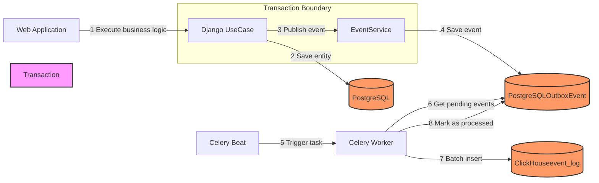

# Die Hard

This is a project with a test task for backend developers.

You can find detailed requirements by clicking the links:
- [English version](docs/task_en.md)
- [Russian version](docs/task_ru.md)

Tech stack:
- Python 3.13
- Django 5
- pytest
- Docker & docker-compose
- PostgreSQL
- ClickHouse

## Installation

Put a `.env` file into the `src/core` directory. You can start with a template file:

```
cp src/core/.env.ci src/core/.env
```

Run the containers with
```
make run
```

and then run the installation script with:

```
make install
```

## Tests

`make test`

## Linter

`make lint`

# Event Logging System with Outbox Pattern

## Overview
This project implements a reliable event logging system using the Transactional Outbox pattern for a Django application. It ensures reliable event delivery to ClickHouse while maintaining system performance and user experience.

## Problem Statement
The original implementation faced several challenges:
- Event loss during system failures between business logic execution and ClickHouse writes
- User experience degradation due to synchronous ClickHouse writes
- Performance issues in ClickHouse due to many small inserts
- Lack of transactional guarantees

## Solution
Implemented the Transactional Outbox pattern with the following components:
- Events are first saved to PostgreSQL within the same transaction as business logic
- Celery worker processes events in configurable batches
- Reliable event delivery to ClickHouse through background processing
- Clear separation between business operations and event logging
- Batch processing to optimize ClickHouse performance

## Technical Stack
- Python 3.13
- Django
- PostgreSQL 16
- ClickHouse 23.8
- Celery with Redis
- Docker & Docker Compose

## Project Structure
```bash
src/
├── core/                     # Core application
│   ├── models.py             # Contains OutboxEvent model
│   ├── services/             
│   │   └── event_service.py  # Event publishing service
│   ├── tasks.py              # Celery tasks
│   └── settings.py           # Project settings
├── users/                    # Users application
└── manage.py                 
```

## Installation and Setup

### Prerequisites
- Docker and Docker Compose installed
- Git

### Installation Steps

1. Clone the repository:
```bash
git clone https://github.com/fedorello/python-log-backender-challenge.git
cd python-log-backender-challenge
```

2. Create environment file:
```bash
cp src/core/.env.example src/core/.env
```

3. Configure environment variables in `src/core/.env`:
```env
DEBUG=true
ALLOWED_HOSTS=localhost,
DATABASE_URL=postgres://test_user:123456@db:5432/test_database
SECRET_KEY="your_secret_key"
CELERY_BROKER=redis://redis:6379/0
CLICKHOUSE_HOST=clickhouse
CLICKHOUSE_PORT=8123
CLICKHOUSE_BATCH_SIZE=100
```

4. Build and start services:
```bash
docker-compose up -d
```

5. Apply database migrations:
```bash
docker-compose exec app python manage.py migrate
```

### Verify Installation

1. Check if all services are running:
```bash
docker-compose ps
```

2. Test event logging system:
```bash
# Access Django shell
docker-compose exec app python manage.py shell

# Create test user and check event logging
from users.use_cases import CreateUser, CreateUserRequest
use_case = CreateUser()
request = CreateUserRequest(
    email='test@example.com',
    first_name='Test',
    last_name='User'
)
response = use_case.execute(request)
```

## Architecture
The system follows these steps:
1. Business operation executes (e.g., user creation)
2. Event is saved to PostgreSQL OutboxEvent table in the same transaction
3. Celery worker picks up pending events in batches
4. Events are delivered to ClickHouse
5. Successful events are marked as processed

Here's the system architecture diagram:



## Usage

### Creating Events
```python
from core.services.event_service import EventService

# Publish event
EventService.publish_event(
    event_type='user_created',
    event_data={'email': 'user@example.com'}
)
```

### Monitoring
Monitor the system using Docker Compose logs:
```bash
# All services
docker-compose logs -f

# Specific service
docker-compose logs -f celery_worker
docker-compose logs -f app
```

### Database Access
```bash
# PostgreSQL
docker-compose exec db psql -U test_pg_user -d test_database -c "SELECT * FROM core_outboxevent;"

# ClickHouse
docker-compose exec clickhouse clickhouse-client --query "SELECT * FROM default.event_log;"
```

## Testing
Run the test suite:
```bash
docker-compose exec app python -m pytest
```

## Development

### Clean Start
To start with a clean slate:
```bash
docker-compose down -v  # Remove all containers and volumes
docker-compose up -d   # Start fresh
docker-compose exec app python manage.py migrate
```

### Code Style
The project follows PEP 8 guidelines. Before committing:
```bash
# Install development dependencies
pip install black isort flake8

# Format code
black .
isort .
flake8
```

## Contributing
1. Fork the repository
2. Create a feature branch
3. Commit changes
4. Push to the branch
5. Create a Pull Request

## Testing Strategy

Our testing approach focuses on ensuring the reliability of the event logging system. Here's what we test and why:

### Event Publishing Tests (`test_event_service.py`)

1. **Successful Event Publishing**
```python
def test_publish_event_success():
    """Test successful event publishing"""
    EventService.publish_event('test_event', {'test': 'data'})
    
    event = OutboxEvent.objects.first()
    assert event.event_type == 'test_event'
    assert event.event_data == {'test': 'data'}
    assert event.status == OutboxEvent.STATUS_PENDING
```
This test ensures that:
- Events are correctly saved to the outbox table
- All event fields are properly stored
- Initial event status is set to 'pending'

2. **Error Handling**
```python
def test_publish_event_database_error(mocker):
    """Test handling of database errors during event publishing"""
    mocker.patch('core.models.OutboxEvent.objects.create',
                 side_effect=DatabaseError("Test DB Error"))
    
    with pytest.raises(EventPublishError) as exc_info:
        EventService.publish_event('test_event', {'test': 'data'})
    
    assert "Failed to publish event" in str(exc_info.value)
```
This test verifies that:
- Database errors are properly caught and wrapped
- Custom EventPublishError is raised with meaningful message
- System fails gracefully when database operations fail

### Integration Tests

Our tests use real PostgreSQL and ClickHouse instances (via Docker) instead of mocks where possible. This ensures:
- Real database interactions are tested
- Transaction handling works as expected
- Integration between services functions correctly

### Running Tests

1. Run all tests:
```bash
docker-compose exec app pytest
```

### Test Dependencies
- `pytest-django`: For Django test utilities and fixtures
- `pytest-mock`: For mocking in Python tests

### What We Test

1. **Event Publishing**
   - Successful event creation
   - Error handling
   - Transaction integrity

2. **Event Processing**
   - Batch processing
   - Error handling during processing
   - Retry mechanism

3. **Integration Points**
   - PostgreSQL interactions
   - ClickHouse interactions
   - Celery task execution

4. **Edge Cases**
   - Database errors
   - Network failures
   - Invalid event data

### What We Don't Mock
We prefer using real instances over mocks for:
- Database connections
- ClickHouse operations
- Basic Django ORM operations

This ensures our tests catch real-world issues that might be missed with mocks.

### Future Test Improvements
- Add performance tests for batch processing
- Add stress tests for high event volumes
- Add monitoring tests for queue metrics
- Add end-to-end tests for complete event flow

# Sentry Integration Documentation

## Overview

This document describes how Sentry is integrated into our event logging system for monitoring, error tracking, and performance analysis.

## Purpose

Sentry integration serves several key purposes in our project:
1. Transaction monitoring for event processing
2. Error tracking and debugging
3. Performance monitoring for batch operations
4. Real-time alerts for critical issues

## Implementation

### Core Components

1. **Event Processing Monitoring**
```python
# core/tasks.py

@shared_task
def process_outbox_events():
    """Monitored by Sentry transaction"""
    with start_transaction(op="process_events", name="process_outbox_events") as transaction:
        try:
            # Process events...
            transaction.set_status("ok")
        except Exception as e:
            transaction.set_status("internal_error")
            transaction.set_data("error", str(e))
            raise
```

2. **Transaction Data Points**
- Batch size
- Processing status
- Error information
- Processing duration

### Key Metrics Tracked

1. **Success Metrics**
- Number of events processed
- Batch processing time
- Queue size

2. **Error Metrics**
- Failed events count
- Error types
- Retry attempts

## Testing

### Unit Tests Location
Tests are located in `core/tests/test_outbox_processing_tests.py` (note the '_tests.py' suffix as per pytest configuration)

### Key Test Scenarios
```python
def test_process_outbox_events_sentry_integration():
    """Tests successful event processing with Sentry monitoring"""
    # Test implementation...

def test_process_outbox_events_sentry_error_handling():
    """Tests error handling and Sentry error reporting"""
    # Test implementation...
```

### Running Tests
```bash
# Run all tests
docker-compose exec app pytest
```

## Configuration

### Environment Variables
```env
SENTRY_CONFIG_DSN="your-sentry-dsn"
SENTRY_CONFIG_ENVIRONMENT="dev"
```

### Sentry Setup in Django
```python
# core/settings.py

SENTRY_SETTINGS = {
    "dsn": env("SENTRY_CONFIG_DSN"),
    "environment": env("SENTRY_CONFIG_ENVIRONMENT"),
}

if SENTRY_SETTINGS.get("dsn") and not DEBUG:
    sentry_sdk.init(
        dsn=SENTRY_SETTINGS["dsn"],
        environment=SENTRY_SETTINGS["environment"],
        integrations=[
            sentry_sdk.DjangoIntegration(),
            sentry_sdk.CeleryIntegration(),
        ],
        default_integrations=False,
    )
```

## Monitoring in Sentry UI

### Key Areas to Monitor

1. **Performance**
- Transaction duration
- Batch processing time
- Queue processing metrics

2. **Issues**
- Failed event processing
- Database connection issues
- ClickHouse insertion errors

3. **Alerts**
- High error rates
- Processing delays
- Queue buildup

### Custom Queries

Monitor failed events:
```sql
type:transaction op:process_events status:internal_error
```

## Best Practices

1. **Transaction Naming**
- Use consistent operation names
- Include meaningful context
- Follow `operation_action` format

2. **Error Handling**
- Always set transaction status
- Include relevant error context
- Use proper error grouping

3. **Performance Monitoring**
- Monitor batch sizes
- Track processing duration
- Set appropriate alert thresholds

## Troubleshooting

Common issues and solutions:
1. Missing transactions
   - Check Sentry DSN configuration
   - Verify environment settings

2. Incomplete error data
   - Ensure proper exception handling
   - Check context data inclusion

3. Performance issues
   - Monitor batch sizes
   - Check database connection pools
   - Verify ClickHouse performance

