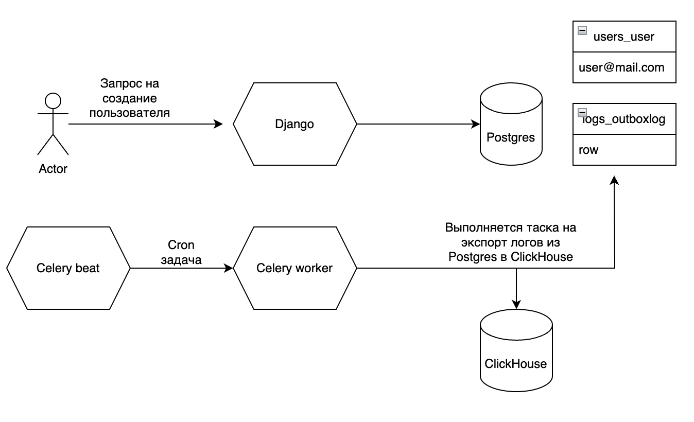

## Техническое решение задачи:
Использовал паттерн transactional outbox.

Создал новый django app, который отвечает за работу с логами.

В нем создал модель OutboxLog, в которой будут временно храниться логи.
В качестве первичного ключа решил использовать ulid в формате uuid.
После экспорта решил не удалять записи сразу, а лишь помечать как экспортированные, что может быть полезным при каких-то проблемах и позволяет при необходимости выполнить повторный экспорт.
Добавил 2 индекса exported_at с разными условиями, чтобы более оптимально фильтровать данные при разных запросах.

В классе OutboxLogger инкапсулирована логика по сохранению логов в базу данных.

В классе OutboxExporter инкапсулирована логика по экспорту логов в ClickHouse и последующему удалению старых экспортированных логов.

## Схема работы:
При запросе клиента на создание пользователя работа с базой данных происходит в транзакции. 
Это гарантирует, что при создании нового пользователя будет записан соответствующий лог в OutboxLog.

Celery beat каждую минуту запускает фоновую таску, которая выполняет экспорт логов в ClickHouse.

Celery beat раз в сутки запускает другую фоновую таску, которая удаляет старые экспортированные логи.

Таски выполняются в очереди outbox. Сейчас есть лишь 1 селери воркер с concurrency=1.

При добавлении новых тасок имеет смысл также оставить 1 воркер с concurrency=1, который смотрит только на очередь outbox.
Для остальных очередей создать свои воркеры с любым concurrency.

## По структуре:
Мне нравится, когда тесты отделены от основного кода (всё в одном месте, удобно шарить фикстуры), поэтому перенес их в отдельную папку.

## Тестирование
Покрыл все кейсы тестами при помощи pytest и pytest-django.

Добавил вью для тестирования реальной работы приложения.

`curl -X POST http://localhost:8000/api/user/ -H "Content-Type: application/json" -d '{"email": "user1@mail.com", "first_name": "test1", "last_name": "testovich1"}'`
